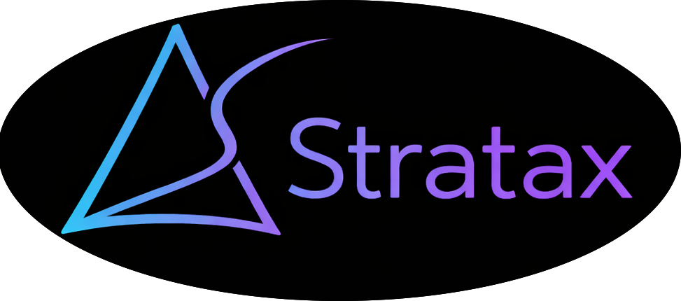

# Stratax Trade

<div align="center">

 <!-- Replace with actual banner -->

**Decentralized Leveraged Positions on Ethereum**

Amplify your gains with up to 5x leverage on any supported asset

[](https://stratax.trade) <!-- Add URL -->
[](https://stratax.gitbook.io/stratax-docs/) <!-- Add GitBook URL -->
[](https://x.com/stratax_trade) <!-- Add Twitter -->
[](https://discord.gg/ekdnKGKGnq) <!-- Add Discord -->

</div>

---

## 🎯 What is Stratax?

Stratax is a decentralized protocol that enables users to open leveraged long or short positions on crypto assets using **Aave V3** lending and **1inch** routing. Each position is represented as an NFT, making it transferable and composable with other DeFi protocols.

### Key Features

- **📈 Up to 5x Leverage** - Based on asset LTV parameters
- **⚡ Flash Loan Powered** - No large liquidity pools required
- **🎨 NFT Positions** - Each position is an ERC-721 token
- **🔧 Flexible Management** - Add/remove collateral, adjust leverage anytime
- **🛡️ Safety First** - Built-in margins prevent liquidation
- **🔄 Atomic Operations** - All-or-nothing position creation/closure

## 🏗️ How It Works

```
User Deposits Collateral → Flash Loan → Supply to Aave → Borrow → Swap → Repay → Leveraged Position
```

**Long Example**: Deposit USDC → Borrow ETH → Swap to USDC → Profit when ETH rises  
**Short Example**: Deposit ETH → Borrow USDC → Swap to ETH → Profit when ETH falls

## 🚀 Get Started

### For Users

1. **Connect Wallet** - [App]() <!-- Add app URL -->
2. **Choose Asset** - Select collateral & borrow token
3. **Set Leverage** - Choose 1.5x to 5x leverage
4. **Open Position** - Create your leveraged position as an NFT
5. **Manage** - Monitor, adjust, or close anytime

### For Developers

```bash
# Clone the contracts repository
git clone https://github.com/Stratax-Trade/contracts.git

# Install dependencies
forge install

# Run tests
forge test
```

📖 **Full Documentation**: [GitBook](https://stratax.gitbook.io/stratax-docs/) <!-- Add GitBook URL -->

## 📦 Repositories

| Repository                                              | Description               | Status         |
| ------------------------------------------------------- | ------------------------- | -------------- |
| [contracts](https://github.com/Stratax-Trade/contracts) | Core smart contracts      | ✅ Active      |
| [app](https://stratax.trade)                            | Frontend dApp             | 🚧 Coming Soon |
| [sdk]()                                                 | JavaScript/TypeScript SDK | 🚧 Coming Soon |
| [docs](https://stratax.gitbook.io/stratax-docs/)        | Documentation & guides    | ✅ Active      |

## 🏛️ Architecture

```
┌──────────────────────────────────────────────────┐
│                    User                          │
└──────────────────┬───────────────────────────────┘
                   │
         ┌─────────▼─────────┐
         │ StrataxPositionNFT │ (Factory)
         └─────────┬──────────┘
                   │
         ┌─────────▼─────────┐
         │  Stratax Proxy    │ (Per Position)
         └───┬───┬───┬───┬───┘
             │   │   │   │
    ┌────────┘   │   │   └────────┐
    │            │   │            │
┌───▼───┐  ┌────▼───▼────┐  ┌────▼────────┐
│ Aave  │  │   1inch     │  │  Chainlink  │
│  V3   │  │   Router    │  │   Oracles   │
└───────┘  └─────────────┘  └─────────────┘
```

## 🔐 Security

- ✅ Reentrancy protection on all external calls
- ✅ Slippage protection via minimum return amounts
- ✅ Health factor validation
- ✅ Owner-only position management
- 🔍 **Audits**: [Coming Soon]() <!-- Add audit links -->

## 🌟 Supported Assets

### Mainnet (Ethereum)

| Asset | Max Leverage | Chainlink Feed |
| ----- | ------------ | -------------- |
| WETH  | ~4.6x        | ✅             |
| WBTC  | ~3.1x        | ✅             |
| USDC  | ~4.6x        | ✅             |
| DAI   | ~3.8x        | ✅             |

_More assets coming soon_

## 💰 Protocol Fees

- **Opening Fee**: 0.15% - 0.30% of position size × leverage
- **Closing Fee**: 0.15% - 0.30% of position size
- **Aave Flash Loan**: 0.05%
- **1inch Swap**: Variable (typically 0.1% - 0.5%)

## 🤝 Built With

<div align="center">

[](https://aave.com/)
[](https://1inch.io/)
[](https://chain.link/)
[](https://openzeppelin.com/)
[](https://getfoundry.sh/)

</div>

## 📊 Stats

<!-- Add actual stats when available -->

```
🎨 Positions Created:     -
💰 Total Value Locked:    -
📈 Total Volume:          -
👥 Active Users:          -
🌍 Networks:              Ethereum Mainnet
```

## 🗺️ Roadmap

- [x] Core smart contracts
- [x] Unit & fork tests
- [x] Documentation
- [ ] Security audit
- [ ] Mainnet deployment
- [ ] Frontend dApp
- [ ] SDK release
- [ ] Multi-chain expansion (Base, Arbitrum)
- [ ] Additional asset support
- [ ] Governance token

## 📢 Community

Join our community to stay updated!

- **Twitter**: [Follow us](https://x.com/stratax_trade) <!-- Add Twitter -->
- **Discord**: [Join server](https://discord.gg/ekdnKGKGnq) <!-- Add Discord -->
- **GitHub**: [Star & contribute](https://github.com/Stratax-Trade)
- **Documentation**: [Read the docs](https://stratax.gitbook.io/stratax-docs/) <!-- Add GitBook -->
- **Blog**: [Coming Soon]() <!-- Add Medium/Mirror -->

## 🤝 Contributing

We welcome contributions! See our [Contributing Guide]() for details. <!-- Add link -->

### Ways to Contribute

- 🐛 Report bugs
- 💡 Suggest features
- 📝 Improve documentation
- 🔧 Submit PRs
- 🧪 Write tests
- 🌍 Translate

## 📄 License

UNLICENSED - See individual repositories for details.

---

<div align="center">

**Built with ❤️ by the Stratax team**

[Website](https://stratax.trade) • [Docs](https://stratax.gitbook.io/stratax-docs/) • [Twitter](https://x.com/stratax_trade) • [Discord](https://discord.gg/ekdnKGKGnq)

</div>
